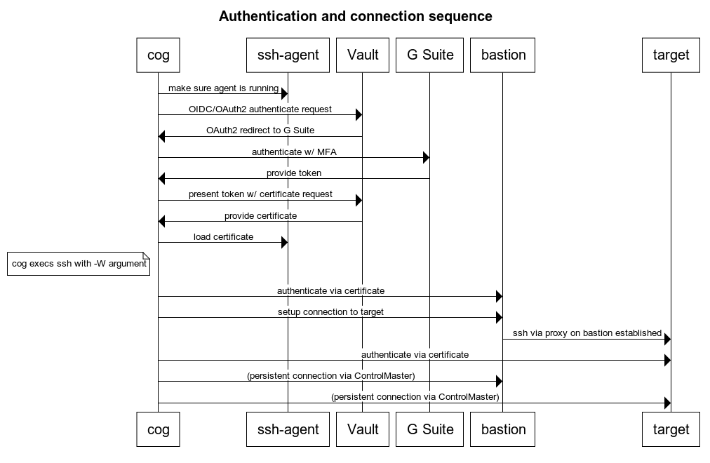

# Cog

## Overview

`cog` is a tool that facilitates SSHing to your infrastructure.

`cog` uses HashiCorp Vault behind the scenes to sign Host and Client SSH Certificates.
With the SSH Certificates properly installed on your target hosts, `cog` will easily SSH through a bastion to your target host.
No more pushing personal SSH Certificates around to `~/.ssh/authorized_keys`. No more blind accepting of Host Certificates. `cog` makes this all transparent for you.

In production, `cog` can take advantage of GCP's [Identity Aware Proxy](https://cloud.google.com/iap/docs/concepts-overview) to use Google's central authentication. This also enables multifactor authentication and keeps HashiCorp Vault more secure.

You can read about the history of cog [here](docs/history.md).

## Local Demo

In about a minute, you can play with cog without the GCP infrastructure by using the [examples/1_docker_without_gcp](examples/1_docker_without_gcp) directory. See the
[README.md](examples/1_docker_without_gcp/README.md) for details.

All it requires is golang to compile the cog binary, a working docker installation, vault, and terraform
to create the running configuration inside of HashiCorp Vault.

## GCP Setup Instructions

When you're ready to move the HashiCorp Vault infrastructure to GCP to make a production-like environment, you can use the provided Terraform to create it.

There are three terraform directories under [terraform/](terraform/). They should be terraformed in order. The
version of terraform required is `0.13`.

[1_gcp_infrastructure](terraform/1_gcp_infrastructure) sets up two compute instances running vault with the necessary backend services, IAM permissions,
and Identity Aware Proxy. Reference the [README.md](terraform/1_gcp_infrastructure/README.md) file in the [terraform/1_gcp_infrastructure](terraform/1_gcp_infrastructure) directory.

[2_vault_configuration](terraform/2_vault_configuration) configures vault itself for SSH certificate signing. Reference the [README.md](terraform/2_vault_configuration/README.md)
in the [terraform/2_vault_configuration](terraform/2_vault_configuration) directory.

[3_users](terraform/3_users) allows you to create user accounts. Reference the [README.md](terraform/3_users/README.md) in the [terraform/3_users](terraform/3_users) directory.

## GCP Demo

This demo will use the GCP infrastructure created above, and will use a local docker installation to launch two hosts (one bastion, one target). You can then use `cog` to communicate to Vault via an IAP tunnel and then SSH to the infrastructure. This most closely demonstrates how to use `cog` in production.

## Workflow Diagram

## Moving to production

Ideally, the users of `cog` will download your custom `cog` binary, run `cog init`, and be able to use `cog` without further configuration. To prepare for this reality, the steps you need to take are documented in [docs/moving_to_production.md](docs/moving_to_production.md). The steps are:

* Building the cog binary
* Creating inventory
* Configuring local SSH to enable cog
* Creating a known_hosts file for client-side host verification
* Trusted user CA keys
* Host key signing
* Configuring SSH on your hosts

## End user documentation

The intention is that `cog` is easy to install and configure, and then disappears into the background as users continue to use SSH the way they have previously. User documentation is documented in [docs/user_documentation.md](docs/user_documentation.md).

## Gotchas

Some developer tools (e.g. PyCharm) use their own implementation of SSH instead of the local system's installation, and therefore do not respect all settings in `~/.ssh/config`. We currently don't have an excellent work-around for this.